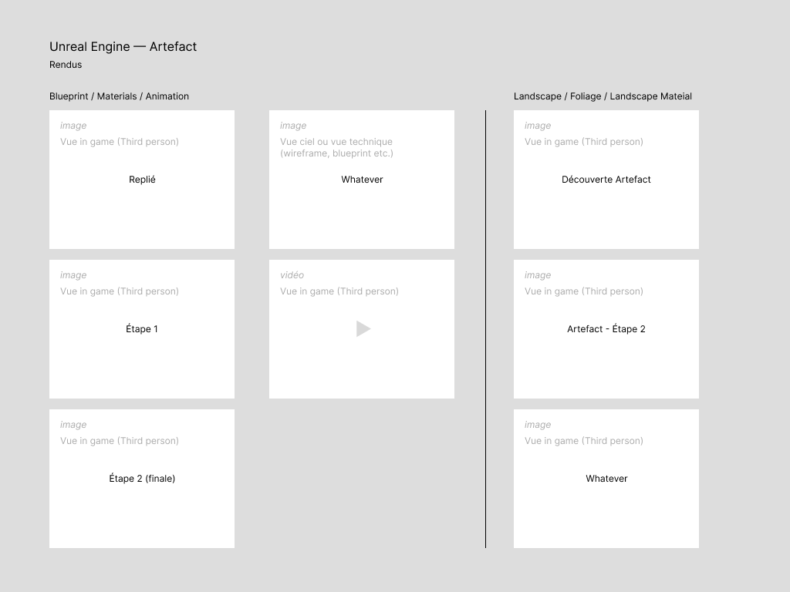

# SDC_GD2_2324_UE5_V2

Sup de Création — Projet Unreal — Blueprints, Materials...

https://github.com/jniac/SDC_GD2_2324_UE5_LSP

## Artefact 

Rendu janvier 2023

Attendu :
- Rendu UE5 de l'artefact dans le projet [SDC_GD2_2324_UE5_V2](https://github.com/jniac/SDC_GD2_2324_UE5_V2/) (Version Control > Submit Content + VSCode push)
- Rendu UE5 du landscape (UE5) dans le projet [SDC_GD2_2324_UE5_LSP](https://github.com/jniac/SDC_GD2_2324_UE5_LSP) (Version Control > Submit Content + VSCode push)
- Rendu WEB : Capture d'écran statique + vidéo de l'artefact dans les deux projets (cf ci dessous).

